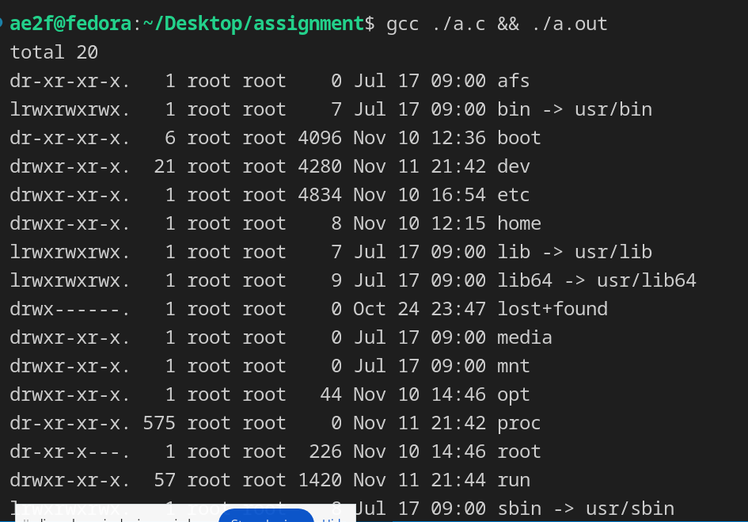
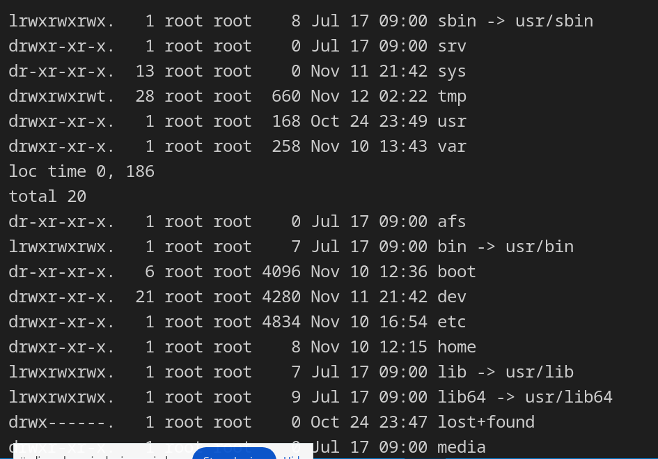
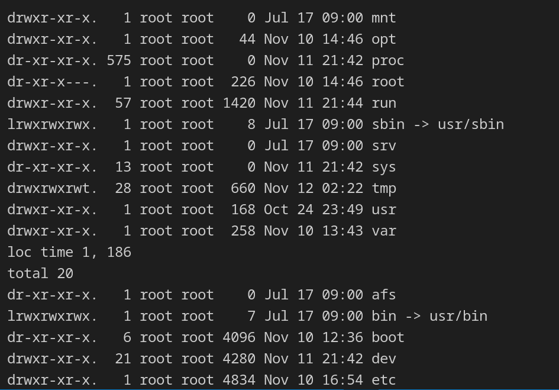
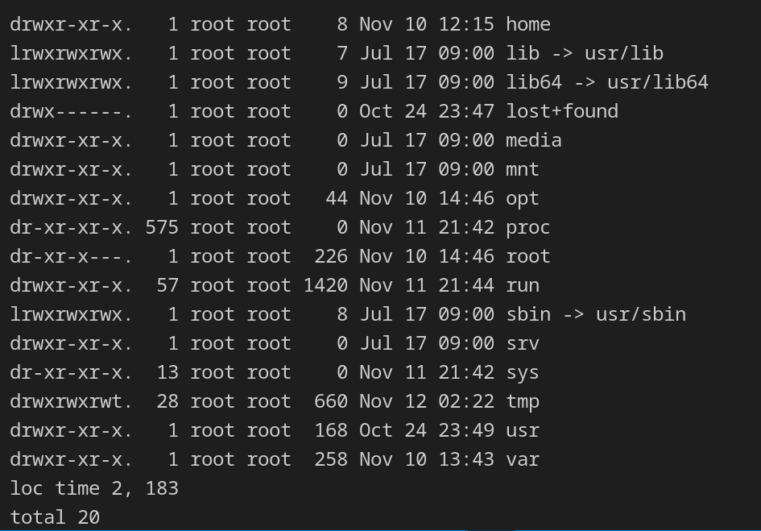
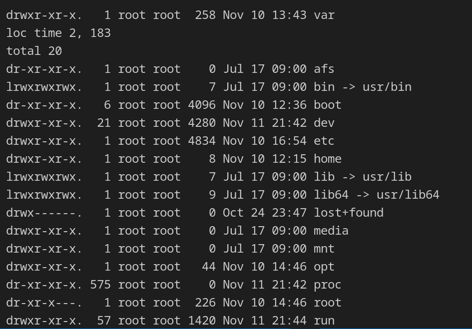
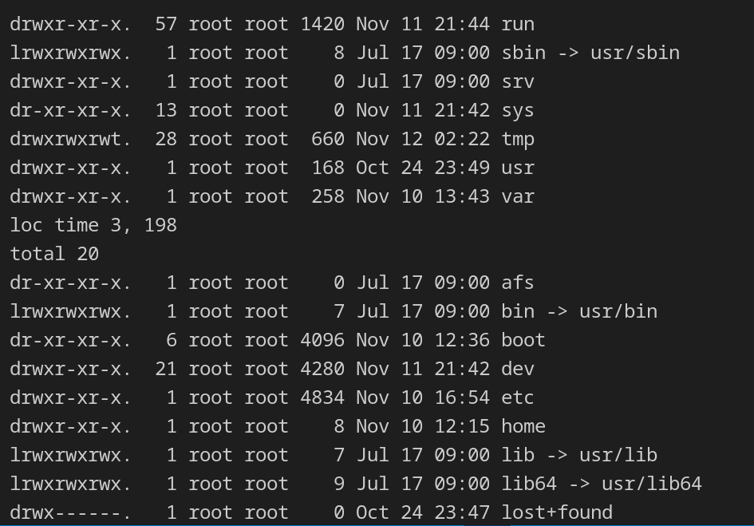
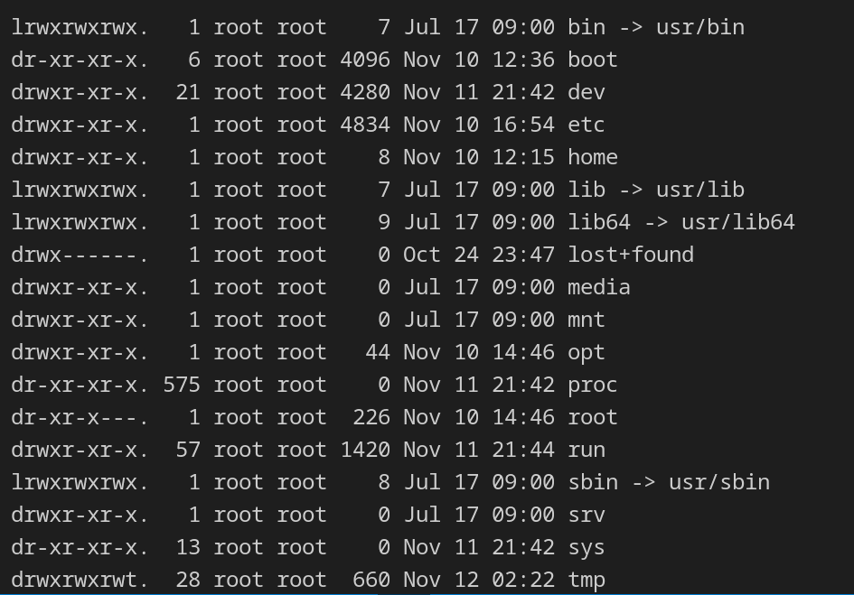
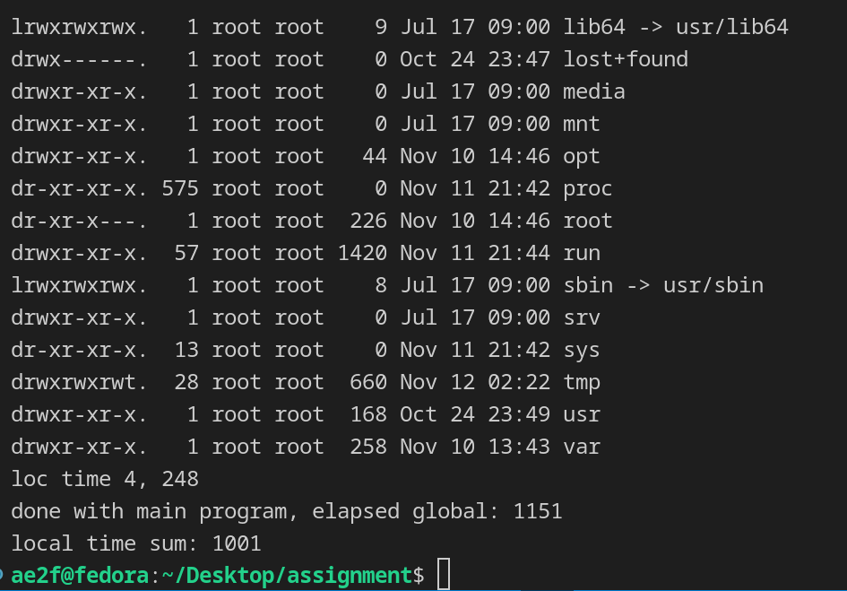
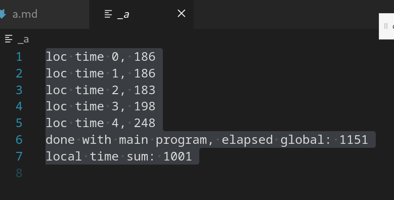
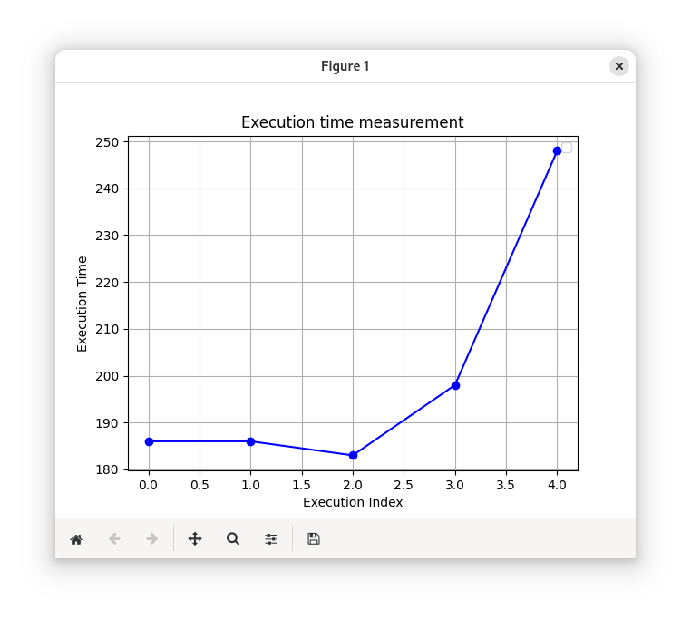

# Author
> 2024011240 차호련

# exec
> Turns a current process to whole different process.  

> Still, the graph of it will not change.  
> Which means if it has parent process, the parent will still think it is his children.  

> The turned process(newly executing) will preserve its own process id.

> After called, since process is now target programme found, existing process will not continue.  
> Which means no code after exec-like functions must execute, otherwise stands for an exception situation.

## exec-like functions naming
- exec
    > implements the work of `exec`.

- l
    > Using variable argument (aka va_list) for sending arguments for new process.

- v
    > Using dynamic vector for sending arguments for new process.

    > Sends 0(aka null) for a last index, which could notify that is the last element of the argument list.

- e
    > Environment variables could be sent. Explicitly.

- v
    > The position of the process will be searched with PATH.

# Measuring
- Execute the `spawn` written in a book of exec.  
- Measure the time `spawn` taking.

## function `spawn`
- Creates a new process (fork)
- Child process (newly created) will turn into `ls`. So we will no require the host process to be turned.

## function `main`
- call `spawn` five times.
- 

> I am iterating the spawn function five times.

```c
#include <stdio.h> 
#include <stdlib.h> 
#include <sys/types.h> 
#include <unistd.h>
#include <wait.h>
#include <time.h>


/* Spawn a child process running a new program. PROGRAM is the name of the program to run; the path will be searched for this program. ARG_LIST is a NULL-terminated list of character strings to be passed as the program's argument list. Returns the process ID of the spawned process. */
int spawn(const char* program, char** const arg_list)
{ 
    pid_t child_pid;

    /* Duplicate this process. */ 
    child_pid = fork();
    if (child_pid != 0)
    /* This is the parent process. */
    return child_pid;

    else {
        /* Now execute PROGRAM, searching for it in the path. */
        execvp(program, arg_list);

        /* The execvp function returns only if an error occurs. */
        perror("an error occurred in execvp\n");
        abort();
    }
}

int main()
{
    FILE* _ = fopen("_a", "w");

    clock_t 
        global_time = clock(),
        global_time_end,
        loc_time = clock(),
        loc_time_end;

    /* The argument list to pass to the "Is" command. */ 
    char* arg_list[] = {
        "ls", /* argv[0], the name of the program. */
        "-l",
        "/",
        NULL /* The argument list must end with a NULL. */
    };

    for(int i = 0; i < 5; i++) {
        loc_time = clock();
        /* Spawn a child process running the "Is" command. Ignore the
        returned child process ID. */ 
        spawn("ls", arg_list);

        wait(0); // wait until child process die

        loc_time_end = clock();
        printf("loc time %d, %d\n", i, loc_time_end - loc_time);
        fprintf(_, "loc time %d, %d\n", i, loc_time_end - loc_time);
    }

    global_time_end = clock();
    printf("done with main program, elapsed global: %d\n", global_time_end - global_time);
    fprintf(_, "done with main program, elapsed global: %d\n", global_time_end - global_time);

    fclose(_);
    return 0;
}
```


# Output stored in console
> The whole output will be printed out on stdout.  
> Including the output of ls, and time measurement.










# Output stored in file "_a"
> Time measurement will be stored in a file called `_a` for my convenience of checking them at once.  
> Content of file will be printed on console also.



> It seems 

# Graph Drawing
> I am going to use python for drawing a graph.  
> So it could be checked both on Linux and Windows.


```py
import matplotlib.pyplot as plt


x = [0, 1, 2, 3, 4]
y = [186, 186, 183, 198, 248]

plt.plot(x, y, marker='o', linestyle='-', color='b')

plt.title('Execution time measurement')
plt.xlabel('Execution Index')
plt.ylabel('Execution Time')

plt.legend()

plt.grid()
plt.show()
```


## Figure Screenshot

